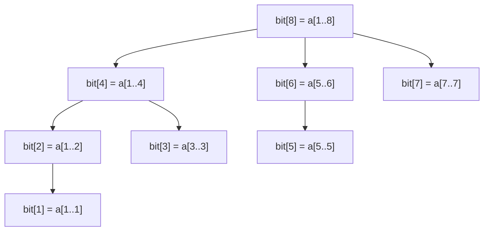

A **Fenwick tree**, also called a **Binary Indexed Tree (BIT)**, does exactly one thing extremely well: maintain prefix sums of an array while individual elements keep changing, both in $O(\log n)$. It is shorter to write than a [[dsa/segment-trees|segment tree]] and has a smaller constant factor, so for the specific "point update + range sum" problem it is the go-to. The catch: it only works for operations that have an inverse (sum, xor — not min/max).

Code is C++, using the standard **1-indexed** convention.

## 1. The problem it solves

Same setup as the segment tree: an array with two mixed request types — *"sum of `a[l..r]`?"* and *"change `a[i]`."* A plain prefix-sum array does queries in $O(1)$ but each update costs $O(n)$ (every prefix past `i` shifts). A Fenwick tree balances both to $O(\log n)$.

Why learn it if a segment tree already covers this? Because when the operation is just **sum** (or xor), the BIT is ~10 lines instead of ~40, uses `n` integers instead of `4n`, and runs faster in practice. In a timed contest or interview, less code means fewer bugs.

## 2. The core idea: each index owns a range sized by its lowest set bit

Store a tree array `bit[1..n]`. The trick is what each cell holds. Index `i` is responsible for the sum of a block of `a` **ending at `i`**, whose length is the value of the lowest set bit of `i`, written `lowbit(i) = i & (-i)`.

- `lowbit(i) = i & (-i)` isolates the lowest set bit. E.g. `lowbit(12) = lowbit(1100_2) = 100_2 = 4`, `lowbit(6) = 2`, `lowbit(8) = 8`.
- So `bit[i]` covers the range `a[i - lowbit(i) + 1 .. i]`.

Worked out for `n = 8` (1-indexed), the ranges each cell covers:

| `i` | binary | `lowbit(i)` | range `bit[i]` covers |
|---|---|---|---|
| 1 | 0001 | 1 | `a[1..1]` |
| 2 | 0010 | 2 | `a[1..2]` |
| 3 | 0011 | 1 | `a[3..3]` |
| 4 | 0100 | 4 | `a[1..4]` |
| 5 | 0101 | 1 | `a[5..5]` |
| 6 | 0110 | 2 | `a[5..6]` |
| 7 | 0111 | 1 | `a[7..7]` |
| 8 | 1000 | 8 | `a[1..8]` |

Notice: to add up a prefix, you stitch together a few of these blocks; to update `a[i]`, you fix every block that contains `i`. Both paths are short because they follow the bits.



## 3. Prefix query: walk down by stripping the lowest bit

`prefixSum(i)` = sum of `a[1..i]`. Start at `i`, add `bit[i]`, then jump to `i - lowbit(i)` (drop the lowest set bit), and repeat until you reach 0.

```cpp
struct Fenwick {
    int n;
    vector<long long> bit;           // 1-indexed, size n+1

    Fenwick(int n) : n(n), bit(n + 1, 0) {}

    long long prefixSum(int i) {     // sum of a[1..i]
        long long s = 0;
        for (; i > 0; i -= i & (-i)) // drop the lowest set bit each step
            s += bit[i];
        return s;
    }

    long long rangeSum(int l, int r) {          // sum of a[l..r]
        return prefixSum(r) - prefixSum(l - 1); // needs an inverse: subtraction
    }
    // update below
};
```

`rangeSum(l, r) = prefixSum(r) - prefixSum(l-1)` is *why* min/max don't work: there is no "subtract" for min.

## 4. Point update: walk up by adding the lowest bit

To do `a[i] += delta`, fix every cell whose block contains `i`. Start at `i`, add `delta` to `bit[i]`, then jump to `i + lowbit(i)`, repeat until you pass `n`.

```cpp
    void update(int i, long long delta) {   // a[i] += delta
        for (; i <= n; i += i & (-i))        // add the lowest set bit each step
            bit[i] += delta;
    }
```

Note the loops are **mirror images**: query strips bits (`i -= i & -i`) and heads toward 0; update adds bits (`i += i & -i`) and heads toward `n`. Each step clears or sets one bit, so each loop runs at most $O(\log n)$ times.

To build: either call `update` for each element ($O(n \log n)$), or use a linear $O(n)$ build that pushes each cell's partial sum to its parent `i + lowbit(i)`.

## 5. Worked example by hand

Start with `a = [3, 2, -1, 6, 5, 4, -3, 3]` (1-indexed, `n = 8`). Build the tree — each `bit[i]` is the sum of its block from the table in Section 2:

- `bit[1] = a[1] = 3`
- `bit[2] = a[1]+a[2] = 5`
- `bit[3] = a[3] = -1`
- `bit[4] = a[1..4] = 3+2-1+6 = 10`
- `bit[5] = a[5] = 5`
- `bit[6] = a[5]+a[6] = 9`
- `bit[7] = a[7] = -3`
- `bit[8] = a[1..8] = 3+2-1+6+5+4-3+3 = 19`

**Query `prefixSum(6)`** (expected `a[1..6] = 3+2-1+6+5+4 = 19`):

- `i = 6` (`110_2`): add `bit[6] = 9`. Strip lowbit(6)=2 → `i = 4`.
- `i = 4` (`100_2`): add `bit[4] = 10`. Strip lowbit(4)=4 → `i = 0`.
- Stop. Total `= 9 + 10 = 19`. ✅

Two cells touched, not six — that is the $\log n$ payoff. The blocks `a[5..6]` and `a[1..4]` tile the prefix `a[1..6]` exactly.

**Query `rangeSum(3, 6)`** (expected `-1+6+5+4 = 14`): `prefixSum(6) - prefixSum(2) = 19 - (a[1]+a[2]) = 19 - 5 = 14`. ✅

**Update `a[3] += 4`** (so `a[3]` goes `-1 → 3`):

- `i = 3` (`011_2`): `bit[3] += 4` → `-1 + 4 = 3`. Add lowbit(3)=1 → `i = 4`.
- `i = 4` (`100_2`): `bit[4] += 4` → `10 + 4 = 14`. Add lowbit(4)=4 → `i = 8`.
- `i = 8` (`1000_2`): `bit[8] += 4` → `19 + 4 = 23`. Add lowbit(8)=8 → `i = 16 > n`. Stop.

Three cells touched — exactly the blocks containing index 3: `bit[3]`, `bit[4]`, `bit[8]`. Now `prefixSum(6)` recomputes to `bit[6] + bit[4] = 9 + 14 = 23`, which equals the new `a[1..6] = 19 + 4 = 23`. ✅

## 6. Range update, point query (the difference-array trick)

If you instead need *"add `x` to every element in `[l, r]`"* and *"read a single `a[i]`,"* flip the roles using a **difference array** stored inside one BIT (initialized to zeros):

- `rangeAdd(l, r, x)` = `update(l, +x)` and `update(r + 1, -x)`.
- point value `a[i]` = `prefixSum(i)`.

```cpp
    void rangeAdd(int l, int r, long long x) {   // add x to a[l..r]
        update(l, x);
        update(r + 1, -x);           // guard r+1 <= n, or size the BIT n+1
    }
    long long pointQuery(int i) { return prefixSum(i); }
```

## 7. Range update + range query (two BITs)

To support range-add **and** range-sum together, keep two Fenwicks `B1`, `B2`. For `rangeAdd(l, r, x)`:

- `B1.update(l, x)`, `B1.update(r+1, -x)`
- `B2.update(l, x*(l-1))`, `B2.update(r+1, -x*r)`

Then `prefixSum(i) = B1.prefixSum(i) * i - B2.prefixSum(i)`, and range sum is the usual difference. `B2` cancels the surplus that appears when you multiply `B1`'s prefix by `i`. This matches a lazy [[dsa/segment-trees|segment tree]] in power for the sum case, still in $O(\log n)$.

## 8. Complexity and comparison

| Operation | Cost |
|---|---|
| Build (naive: `update` × n) | $O(n \log n)$ |
| Build (linear) | $O(n)$ |
| Point update | $O(\log n)$ |
| Prefix / range query | $O(\log n)$ |
| Memory | $O(n)$ — just `n` integers |

Fenwick vs [[dsa/segment-trees|segment tree]]:

| | Fenwick / BIT | Segment tree |
|---|---|---|
| Code length | ~10 lines | ~40 lines |
| Memory | `n` | `4n` |
| Operations | invertible only (sum, xor, count) | **any** associative op (min, max, gcd, …) |
| Range update | needs the two-BIT trick | natural with lazy propagation |
| Constant factor | smaller (faster) | larger |

**Rule of thumb:** point update + prefix/range **sum** → Fenwick (shorter, faster). Need **min/max/gcd**, or you find the two-BIT range-update fiddly → segment tree.

## 9. Practical facts interviewers/CP setters like

- **`i & (-i)` isolates the lowest set bit** thanks to two's-complement: `-i` is `~i + 1`, which flips everything above the lowest set bit and keeps that bit, so the AND leaves only it.
- **Why 1-indexed:** the update loop `i += i & -i` would spin forever at `i = 0` (`0 & 0 = 0`), so index 0 is unused. This is the single most common BIT bug.
- **Order statistics / k-th smallest:** if all values lie in `[1, n]`, a BIT of counts finds the k-th smallest in $O(\log n)$ by "binary lifting on the tree." Common follow-up.
- **Large coordinates** (values up to $10^9$): coordinate-compress first, then index the BIT by rank.
- **min over `[0, r]`** *is* possible on a BIT, but only if updates only ever *decrease* values, and it cannot do arbitrary `[l, r]` — because min has no inverse. When in doubt for min/max, reach for a segment tree.

## 10. Questions actually asked in interviews (with answer hints)

1. **"What does `i & -i` compute, and why?"** — The lowest set bit; two's-complement negation flips all higher bits so the AND isolates it. Cornerstone of both loops.
2. **"Fenwick vs segment tree — when each?"** — Sum/xor + point update → Fenwick (shorter, less memory, faster). Any associative op or easy range updates → segment tree.
3. **"Why can't a BIT do range-min over `[l, r]`?"** — `rangeSum(l,r)=prefix(r)-prefix(l-1)` relies on an **inverse**; min has none, so you can't subtract off the `[1, l-1]` part.
4. **"Walk me through updating one element."** — Start at `i`, add `delta`, jump `i += i & -i` until `i > n`; you touch every block containing `i`, which is $O(\log n)$ cells.
5. **"How would you support range updates with a BIT?"** — Difference-array (one BIT) for range-update/point-query; two BITs for range-update/range-query (Section 7).
6. **"Find the k-th smallest element with a BIT."** — Store counts, binary-lift over the tree in $O(\log n)$; requires values bounded / compressed to `[1, n]`.
7. **"Why is a BIT 1-indexed?"** — Index 0 has `lowbit(0) = 0`; the `i += i & -i` update loop would never advance, so 0 is reserved.

*Grounding: written from two fetched sources — cp-algorithms.com "Fenwick Tree" (the `bit[i]` covers `[g(i), i]` framing, the `i & -i` / `i | (i+1)` loop directions, the difference-array range-update trick, the two-BIT range-update-range-query construction, the $O(\log n)$/$O(n)$ complexities, and the min-only-with-decreasing-updates limitation) and USACO Guide Gold "Point Update Range Sum" (BIT as the shorter, smaller-constant alternative to a segment tree for point-update/range-sum, 1-indexing, order-statistics use, and coordinate compression). All C++ code here was written for this note and hand-traced on `a = [3,2,-1,6,5,4,-3,3]` in Section 5; the `prefixSum(6)=19`, `rangeSum(3,6)=14`, and post-update `=23` results are arithmetic checks, not quoted claims. cp-algorithms content is CC BY-SA 4.0; no text was copied — all explanations are paraphrased.*
