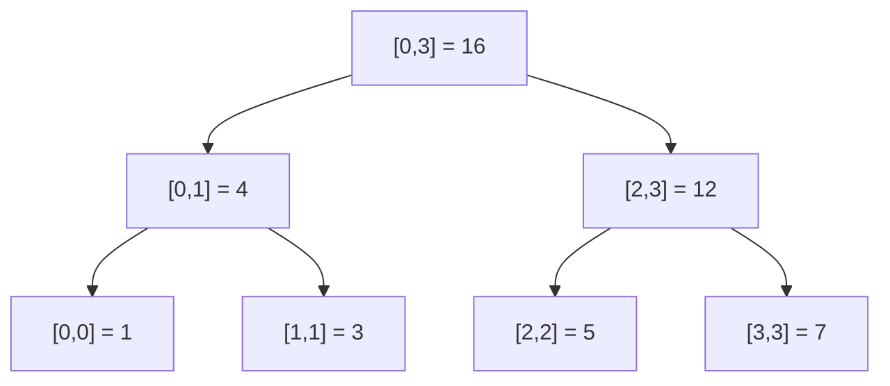

You have an array and two kinds of requests, mixed in any order: *"what is the sum (or min, or max) of elements from index `l` to `r`?"* and *"change the value at index `i`."* A segment tree answers **both** in $O(\log n)$ time each. It is the standard tool the moment "range query" and "update" appear in the same problem.

Code below is C++ (the contest/interview default for this topic — array-backed, no pointers, fast).

## 1. The problem it solves

Suppose you only ever query and never update. Then a **prefix-sum array** answers any range sum in $O(1)$: `sum(l, r) = pre[r+1] - pre[l]`. Done.

The trouble starts when values change. One update to `a[i]` forces you to rebuild every prefix that includes `i` — up to $O(n)$ work per update. With $q$ updates that is $O(nq)$, which times out.

The segment tree gives a balanced trade:

| Operation | Prefix sum | Segment tree |
|---|---|---|
| Point update | $O(n)$ | $O(\log n)$ |
| Range query | $O(1)$ | $O(\log n)$ |

You give up a little query speed to make updates fast. That is almost always the right call in interview problems.

## 2. The core idea

Build a binary tree where **each node owns a contiguous segment of the array** and stores the answer for that segment. The root owns the whole array `[0, n-1]`. A node owning `[l, r]` splits at the midpoint `m = (l + r) / 2` into a left child owning `[l, m]` and a right child owning `[m+1, r]`. Leaves own a single element.

For an array `[1, 3, 5, 7]` (sum tree), each node holds the sum of its segment:



Because the tree is balanced, its height is $O(\log n)$. Every operation walks a few root-to-leaf paths, so every operation is $O(\log n)$.

The **merge function** is the only thing that changes between problem types: sum uses `+`, range-min uses `min`, range-max uses `max`, gcd uses `gcd`. The structure is identical; swap the operator.

## 3. Storage: an array, not pointers

You do **not** allocate node objects. Store the tree in a flat array `tree[]`, using the heap trick:

- node `1` is the root,
- node `v` has children `2v` (left) and `2v + 1` (right).

Size `4 * n` is always safe (a tree over `n` leaves needs at most `2 * next_power_of_two(n)` nodes, and `4n` bounds that for any `n`).

```cpp
struct SegTree {
    int n;
    vector<long long> tree;          // 1-indexed; size 4n

    SegTree(const vector<long long>& a) {
        n = a.size();
        tree.assign(4 * n, 0);
        build(a, 1, 0, n - 1);
    }
    // ... build / query / update below
};
```

## 4. Build

Recurse down, and on the way back up set each node to the merge of its children.

```cpp
void build(const vector<long long>& a, int v, int lo, int hi) {
    if (lo == hi) {                  // leaf: owns one element
        tree[v] = a[lo];
        return;
    }
    int mid = (lo + hi) / 2;
    build(a, 2 * v,     lo,      mid);   // left  child owns [lo, mid]
    build(a, 2 * v + 1, mid + 1, hi);    // right child owns [mid+1, hi]
    tree[v] = tree[2 * v] + tree[2 * v + 1];   // merge
}
```

**Complexity:** build visits each of the $O(n)$ nodes exactly once and does $O(1)$ work per node → $O(n)$ time, $O(n)$ space.

## 5. Range query

Given a query range `[ql, qr]`, at each node compare it to the node's own segment `[lo, hi]`:

1. **No overlap** (`qr < lo` or `hi < ql`) → return the *identity* for the merge (0 for sum, `+inf` for min).
2. **Total overlap** (`ql <= lo` and `hi <= qr`) → return `tree[v]` directly; the node already has the answer.
3. **Partial overlap** → recurse into both children and merge the two results.

```cpp
long long query(int ql, int qr, int v, int lo, int hi) {
    if (qr < lo || hi < ql) return 0;          // case 1: disjoint (identity)
    if (ql <= lo && hi <= qr) return tree[v];  // case 2: fully inside
    int mid = (lo + hi) / 2;                    // case 3: split
    return query(ql, qr, 2 * v,     lo,      mid)
         + query(ql, qr, 2 * v + 1, mid + 1, hi);
}
// call as: query(ql, qr, 1, 0, n - 1)
```

**Why $O(\log n)$:** at each level of the tree, at most **two** nodes are ever in the "partial overlap" state (one on each frontier of the range). Everything else terminates immediately at case 1 (disjoint) or case 2 (fully covered). Two partial nodes per level, and each can spawn at most one more partial child on the next level, so we visit $O(1)$ partial nodes and $O(1)$ terminating nodes per level × $\log n$ levels = $O(\log n)$ nodes total.

## 6. Point update

To set `a[i] = val`: walk down to the leaf for `i`, change it, then re-merge every node on the way back up. Only the single root-to-leaf path changes.

```cpp
void update(int i, long long val, int v, int lo, int hi) {
    if (lo == hi) {                  // reached the leaf
        tree[v] = val;
        return;
    }
    int mid = (lo + hi) / 2;
    if (i <= mid) update(i, val, 2 * v,     lo,      mid);
    else          update(i, val, 2 * v + 1, mid + 1, hi);
    tree[v] = tree[2 * v] + tree[2 * v + 1];   // re-merge on the way up
}
// call as: update(i, val, 1, 0, n - 1)
```

**Complexity:** one root-to-leaf path = tree height = $O(\log n)$ nodes touched.

## 7. Worked example by hand

Array `a = [1, 3, 5, 7]`, sum tree from Section 2.

**Query `sum(1, 2)`** (expected `3 + 5 = 8`). Start at root `[0,3]`, partial overlap → recurse:

- Left child `[0,1]`, still partial → recurse:
  - `[0,0]`: disjoint from `[1,2]` (`0 < 1`) → returns `0`.
  - `[1,1]`: fully inside `[1,2]` → returns `3`.
  - Left child returns `0 + 3 = 3`.
- Right child `[2,3]`, partial → recurse:
  - `[2,2]`: fully inside → returns `5`.
  - `[3,3]`: disjoint (`3 > 2`) → returns `0`.
  - Right child returns `5 + 0 = 5`.
- Root returns `3 + 5 = 8`. ✅

**Counting the work:** we visited 7 nodes for this query on a 4-element array. That looks like "all of them," but it is an artifact of tiny $n$. The point is we never *descended further* into `[0,0]` or `[3,3]` — each was one $O(1)$ check. For an array of size $n = 10^6$, this same query touches roughly $4\log_2 n \approx 80$ nodes, not a million. That gap is the whole reason the structure exists.

**Update `a[2] = 10`** (was `5`). Walk the path `[0,3] → [2,3] → [2,2]`:

- Leaf `[2,2]` becomes `10`.
- Re-merge `[2,3] = 10 + 7 = 17`.
- Re-merge root `[0,3] = 4 + 17 = 21`.

Now `sum(0, 3)` correctly returns `21` = `1 + 3 + 10 + 7`. Only **three** nodes touched (height of the tree), the rest of the tree untouched — that is the $O(\log n)$ update in action.

## 8. Range updates need lazy propagation

The version above updates **one** index. What about *"add 2 to every element in `[l, r]`"*? Doing it point by point is $O(n \log n)$ per range update — too slow.

**Lazy propagation** fixes this. When a range update fully covers a node's segment, you update that node's stored value and **stop**, parking a "pending add" flag (`lazy[v]`) on the node instead of recursing into its children. The pending value is only *pushed down* to children later, the next time some operation actually needs to visit them. Work you might never need, you never do.

Two rules make it correct:

- **Applying** a pending add of `x` to a node owning `k` elements adds `x * k` to its sum (every element in the segment goes up by `x`).
- **Pushing down** copies the parent's pending add into both children's lazy flags, then clears the parent's flag.

```cpp
struct LazySegTree {
    int n;
    vector<long long> tree, lazy;    // both size 4n

    LazySegTree(const vector<long long>& a) {
        n = a.size();
        tree.assign(4 * n, 0);
        lazy.assign(4 * n, 0);
        build(a, 1, 0, n - 1);
    }

    void build(const vector<long long>& a, int v, int lo, int hi) {
        if (lo == hi) { tree[v] = a[lo]; return; }
        int mid = (lo + hi) / 2;
        build(a, 2 * v, lo, mid);
        build(a, 2 * v + 1, mid + 1, hi);
        tree[v] = tree[2 * v] + tree[2 * v + 1];
    }

    void apply(int v, int lo, int hi, long long x) {   // add x to whole segment
        tree[v] += x * (hi - lo + 1);
        lazy[v] += x;                                  // remember it for children
    }

    void push(int v, int lo, int hi) {                 // flush pending add down
        if (lazy[v] != 0) {
            int mid = (lo + hi) / 2;
            apply(2 * v,     lo,      mid, lazy[v]);
            apply(2 * v + 1, mid + 1, hi,  lazy[v]);
            lazy[v] = 0;
        }
    }

    void rangeAdd(int ql, int qr, long long x, int v, int lo, int hi) {
        if (qr < lo || hi < ql) return;
        if (ql <= lo && hi <= qr) {                    // full cover → park, no recurse
            apply(v, lo, hi, x);
            return;
        }
        push(v, lo, hi);                               // partial → must descend, flush first
        int mid = (lo + hi) / 2;
        rangeAdd(ql, qr, x, 2 * v,     lo,      mid);
        rangeAdd(ql, qr, x, 2 * v + 1, mid + 1, hi);
        tree[v] = tree[2 * v] + tree[2 * v + 1];
    }

    long long query(int ql, int qr, int v, int lo, int hi) {
        if (qr < lo || hi < ql) return 0;
        if (ql <= lo && hi <= qr) return tree[v];
        push(v, lo, hi);                               // flush before reading children
        int mid = (lo + hi) / 2;
        return query(ql, qr, 2 * v,     lo,      mid)
             + query(ql, qr, 2 * v + 1, mid + 1, hi);
    }
};
// call as: rangeAdd(l, r, x, 1, 0, n - 1) and query(l, r, 1, 0, n - 1)
```

**Complexity:** the same "at most two partial nodes per level" argument holds, and `push`/`apply` are $O(1)$, so both `rangeAdd` and `query` stay $O(\log n)$ even though a single update can affect a whole range of elements.

### Worked lazy example

Same array `[1, 3, 5, 7]`, sums as in Section 2. Do `rangeAdd(0, 2, +2)` — add 2 to indices 0, 1, 2. Expected array `[3, 5, 7, 7]`, total `22`.

Trace `rangeAdd(0, 2, 2)`:

- Root `[0,3]`: query range `[0,2]` does **not** fully cover it (index 3 is outside) → push (nothing pending yet) and recurse.
- Left child `[0,1]`: fully inside `[0,2]` → apply. `tree = 4 + 2*2 = 8`, `lazy = 2`. **Stop here** — we did not touch `[0,0]` or `[1,1]`.
- Right child `[2,3]`: partial → push, recurse:
  - `[2,2]`: fully inside → apply. `tree = 5 + 2*1 = 7`, `lazy = 2`.
  - `[3,3]`: disjoint → nothing.
  - Re-merge `[2,3] = 7 + 7 = 14`.
- Re-merge root `[0,3] = 8 + 14 = 22`. ✅ (Original 16, plus 2 added to 3 elements.)

Now `query(2, 3)`: root partial → push (root lazy is 0) → right child `[2,3]` fully inside → return `14`. That equals `a[2] + a[3] = 7 + 7`. Correct, and we never had to expand the parked `lazy = 2` on node `[0,1]` because nobody asked about indices 0 or 1 — deferred work that was never needed, never done.

## 9. Comparison with the alternatives

| Structure | Build | Point update | Range query | Range update | Notes |
|---|---|---|---|---|---|
| Prefix sum | $O(n)$ | $O(n)$ | $O(1)$ | $O(n)$ | Best when there are **no** updates |
| Sqrt decomposition | $O(n)$ | $O(1)$ | $O(\sqrt n)$ | $O(\sqrt n)$ | Simple to code, weaker asymptotics |
| Fenwick / BIT | $O(n)$ | $O(\log n)$ | $O(\log n)$ | tricky | Tiny code, sum/xor only, no min/max |
| **Segment tree** | $O(n)$ | $O(\log n)$ | $O(\log n)$ | $O(\log n)$ with lazy | Most general: any associative merge |

Space for all of the above is $O(n)$ (segment tree uses `4n` longs).

Rule of thumb for interviews: **no updates → prefix sum. Only point updates + sum → Fenwick (shorter to write). Everything else, or range updates, or min/max/gcd → segment tree.**

## 10. Variants worth naming (one line each)

- **Fenwick tree (BIT)**: a leaner structure for prefix sums under point updates; less code, but cannot do range-min/max.
- **Merge sort tree**: each node stores its segment *sorted*, enabling "how many values in `[l,r]` are `< k`" style queries.
- **Persistent segment tree**: keeps every historical version by sharing unchanged nodes; answers queries about the array "as of update `t`". Frontier for most placement loops — mention it, don't derive it.

## 11. Questions actually asked in interviews (with answer hints)

1. **"Why $O(\log n)$ per query?"** — At most two nodes per level are partially covered; the rest hit the disjoint or fully-covered base case immediately. $\log n$ levels → $O(\log n)$ nodes.
2. **"Why size `4n`?"** — Rounding `n` up to a power of two can nearly double the leaves, and a full binary tree over `L` leaves has `2L - 1` nodes; `4n` safely bounds it for any `n`.
3. **"What must the merge operation satisfy?"** — Associativity, so that grouping into node segments gives the same answer as processing left to right. Sum, min, max, gcd, and matrix product all qualify.
4. **"When would you pick a Fenwick tree over a segment tree?"** — Only point updates plus prefix sums/xor, and you want minimal code. It cannot do min/max because those are not invertible.
5. **"Explain lazy propagation."** — Park a range update at the highest fully-covered nodes; push it to children only when a later operation needs to descend past them. Turns range updates from $O(n)$ into $O(\log n)$.
6. **"You need range-min *and* range-add together — can Fenwick do it?"** — No; use a lazy segment tree. min is not invertible, so the Fenwick trick breaks.
7. **(Follow-up) "Order of `push` vs recursion in a range update?"** — Push *before* you recurse into children (case 3), because you are about to read/modify them and any parked update must be current first.

*Grounding: algorithms and complexities are standard and were re-derived and hand-checked here (build $O(n)$; query/update $O(\log n)$; lazy range update $O(\log n)$; space $O(n)$). Both code samples were traced by hand on `[1,3,5,7]` in Sections 7–8; the `sum(1,2)=8`, point-update total `21`, and lazy `rangeAdd(0,2,+2)` total `22` results are arithmetic checks, not external claims. Canonical references for further reading: cp-algorithms.com segment-tree article and CLRS on augmented trees — not re-fetched for this draft, so treat exact wording there as unverified.*
