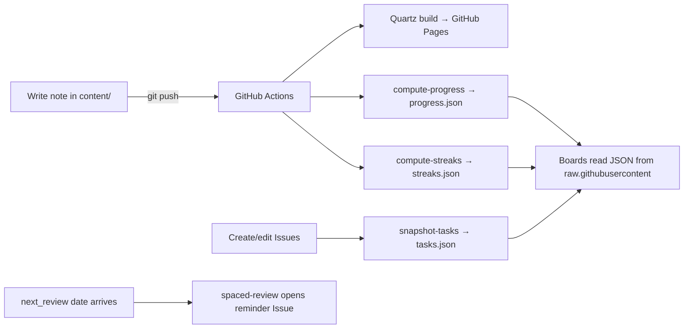

Everything about how this site works. Read [[manual/writing-notes|Writing Notes]] first.

## Pages
- [[manual/writing-notes|Writing Notes]] — markdown, LaTeX, images, callouts, diagrams
- [[manual/frontmatter|Frontmatter Reference]] — the fields that drive automation
- [[manual/roadmap|Roadmap & Progress]] — how progress bars compute and update
- [[manual/tasks-and-issues|Tasks & Issues]] — labels, dashboard, question triage
- [[manual/streaks|Streaks]] — how streaks are counted and refreshed
- [[manual/spaced-review|Spaced Review]] — the +2d / +1w / +3w revision system
- [[manual/policy|Coordination Policy]] — cycles, buffers, collisions, junctions
- [[manual/troubleshooting|Troubleshooting]] — every issue we have hit, with fixes

## The system in one diagram

