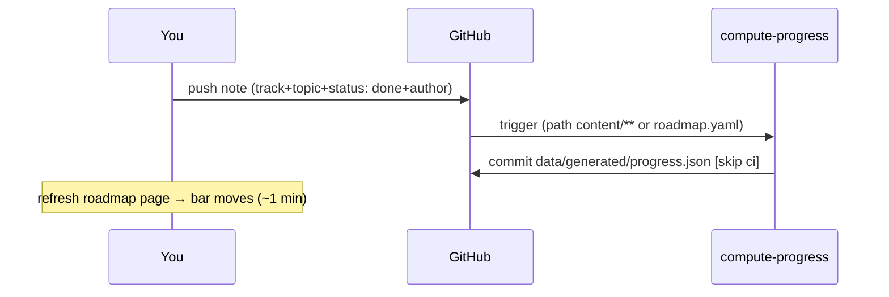

The [Roadmap board](https://harsha-moparthy.github.io/placement-prep/static/roadmap.html) shows per-person completion bars for all four tracks.

## Source of truth
`data/roadmap.yaml` defines every track and topic:

```yaml
tracks:
  dsa:
    title: DSA (Striver A2Z)
    owner: harsha
    topics:
      - {id: arrays, title: Arrays & Hashing}
```

## How a topic turns green



- One `done` note per topic per person is enough; extra notes on the same topic do not double-count.
- Update timing: on every push touching `content/` or `data/roadmap.yaml`; allow up to ~5 min for the raw.githubusercontent CDN cache.

## Editing the syllabus
Add/remove topics in `data/roadmap.yaml` and push. Keep `id` stable once notes reference it — renaming an id orphans existing notes (they stop counting). Percentages recompute automatically since totals come from the YAML.
