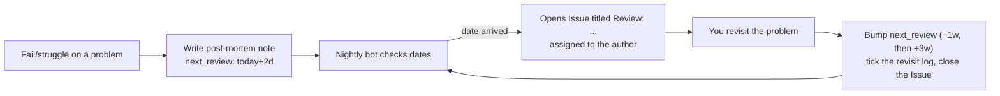

Implements the **+2d → +1w → +3w** revisit schedule automatically.

## Workflow

## Rules
- The bot runs nightly (03:30 IST) and looks at every note's `next_review`.
- It never duplicates: if an open `review` issue with the same title exists, it skips.
- After the third successful revisit (+3w), delete the `next_review` field — the loop ends.
- If a revisit fails (could not re-solve), reset to +2d and restart the ladder.

## Post-mortem discipline
The template (`content/templates/postmortem.md`) forces the four fields that matter: struggle time, your approach, the one-sentence unlock, and the pattern. Fill them immediately after the failure — quality here is what makes the revisit worth anything.
