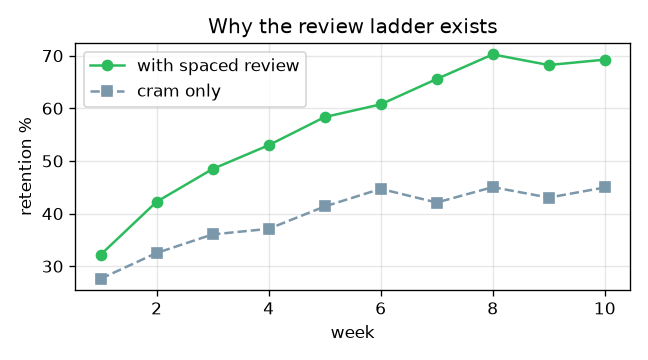
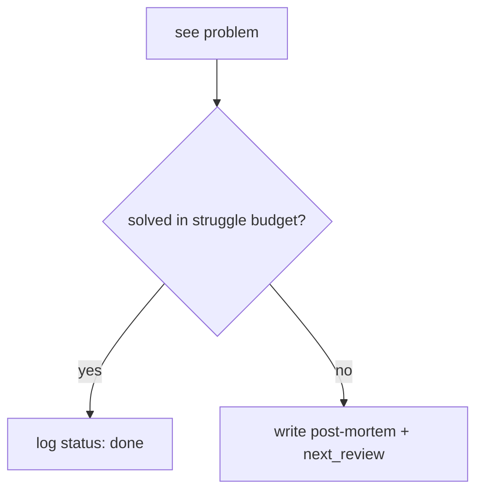

Notes live in `content/<track>/` (`dsa/`, `cp/`, `ml/`, `quant/`, `mocks/`, `retros/`). Copy a template from `content/templates/` to start. Push to publish — the site deploys itself in ~2 minutes.

## Headings, emphasis, lists

```md
# H1  ## H2  ### H3
**bold**  *italic*  ==highlight==  ~~strike~~
- bullet
1. numbered
- [ ] open task
- [x] done task
```

Renders: **bold** *italic* ==highlight== ~~strike~~

- [ ] open task
- [x] done task

## LaTeX

Inline with single dollars: `$E[X+Y] = E[X]+E[Y]$` → $E[X+Y] = E[X]+E[Y]$

Block math needs `$$` **on their own lines** (this is the #1 rendering gotcha):

```md
$$
\operatorname{Var}(X) = E[X^2] - (E[X])^2
$$
```

$$
\operatorname{Var}(X) = E[X^2] - (E[X])^2
$$

Works: matrices, aligned equations, `\mathbb{R}`, `\binom{n}{k}`, sums, integrals.

## Images

Put the image file next to your note (or in an `attachments/` subfolder), then either syntax:

```md
![[example-plot.png]]                 (Obsidian style)
   (standard markdown)
![[example-plot.png|400]]             (fixed width)
```

![[example-plot.png]]

Rules: the path is **case-sensitive**, and the image must live somewhere under `content/`.

## Links

```md
[[dsa/index]]                 link to a note by path
[[dsa/index|the DSA hub]]     with custom text
[[#Images]]                   link to a heading on this page
[external](https://leetcode.com)
```

## Callouts

```md
> [!tip] Interview pattern
> Indicator variables + linearity kills most expected-value questions.

> [!warning]- Collapsed by default (note the minus)
> Hidden until clicked.
```

> [!tip] Interview pattern
> Indicator variables + linearity kills most expected-value questions.

Types: `note`, `tip`, `warning`, `danger`, `example`, `question`, `quote`.

## Code

Fenced with a language for syntax highlighting:

````md
```python
def solve(a):
    return sum(a)
```
````

## Diagrams (mermaid)

````md

````


## Tables

```md
| approach | time | space |
|---|---|---|
| brute force | O(n²) | O(1) |
| two pointers | O(n) | O(1) |
```

## Tags

`#dsa/dp` in text or `tags: [dsa/dp]` in frontmatter → clickable, aggregated on tag pages.
