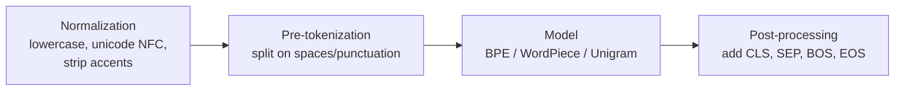

A transformer cannot read text. It reads a sequence of integers. **Tokenization** is the step that converts a string into those integers, using a fixed dictionary called the **vocabulary**. Every LLM interview touches this at least once.

## 1. Why not just words or characters?

- **Word-level**: vocabulary explodes (every typo, plural, and rare word is new), and anything unseen becomes `[UNK]` — the model literally cannot represent it.
- **Character-level**: tiny vocabulary and no unknowns, but sequences become very long, and attention cost grows as $O(n^2)$ in sequence length. The model also wastes capacity re-learning that `t-h-e` means "the".
- **Subword-level** (what everyone uses): common words stay whole (`the`), rare words split into meaningful pieces (`unbelievable` → `un + believ + able`). No unknowns, reasonable lengths.

![[tokenization-granularity.png]]

## 2. The tokenizer pipeline

Every modern tokenizer runs four stages (this framing is from the Hugging Face LLM course):



Example quirk worth knowing: GPT-2 marks a leading space with `Ġ` (`" how"` → `Ġhow`), SentencePiece marks it with `▁`. That is why `"hello"` and `" hello"` are **different tokens** with different ids.

## 3. The three algorithms that matter

### 3.1 Byte-Pair Encoding — BPE (GPT-2/3/4, LLaMA)

Train: start from single characters (or bytes), repeatedly **merge the most frequent adjacent pair** into a new token, until the vocabulary reaches the target size (Sennrich et al., 2015, arXiv:1508.07909).

Encode: split the word into characters, replay the learned merges in order.

```python
# Minimal BPE training loop — a classic interview exercise
from collections import Counter

def train_bpe(corpus_words, num_merges):
    # each word is a tuple of symbols, with its frequency
    vocab = Counter(tuple(w) for w in corpus_words)
    merges = []
    for _ in range(num_merges):
        pairs = Counter()
        for word, f in vocab.items():
            for a, b in zip(word, word[1:]):
                pairs[(a, b)] += f
        if not pairs:
            break
        best = max(pairs, key=pairs.get)          # most frequent adjacent pair
        merges.append(best)
        merged = {}
        for word, f in vocab.items():             # apply the merge everywhere
            w, i = [], 0
            while i < len(word):
                if i < len(word)-1 and (word[i], word[i+1]) == best:
                    w.append(word[i] + word[i+1]); i += 2
                else:
                    w.append(word[i]); i += 1
            merged[tuple(w)] = f
        vocab = merged
    return merges
```

**Byte-level BPE** (GPT-2 onward): start from the 256 raw bytes instead of unicode characters. Any string on earth is representable — zero `[UNK]`, at the cost of unreadable tokens for non-Latin scripts.

### 3.2 WordPiece (BERT)

Same merge idea, different selection rule. Instead of raw pair frequency, it picks the pair maximizing

$$
\text{score}(a,b) = \frac{\text{freq}(ab)}{\text{freq}(a)\cdot \text{freq}(b)}
$$

so it prefers pairs that are *informative together*, not just common. Continuation pieces carry a `##` prefix: `playing` → `play + ##ing`. Encoding is greedy longest-match from the start of the word.

### 3.3 Unigram (T5, many multilingual models; inside SentencePiece)

Works in the **opposite direction**: start from a huge candidate vocabulary, and repeatedly **remove** tokens whose removal least hurts the corpus likelihood. Each token gets a probability $p(t)$; a word's tokenization is the segmentation maximizing

$$
P(x_1,\dots,x_k) = \prod_{j=1}^{k} p(x_j)
$$

found with Viterbi. Probabilistic, so it can also *sample* alternative segmentations (used as regularization during training).

### 3.4 SentencePiece (the wrapper, not an algorithm)

Treats input as a raw unicode stream — no pre-splitting on spaces (spaces become `▁`). This makes it language-agnostic (works for Chinese/Japanese where spaces don't exist) and **losslessly reversible**: decode = concatenate and replace `▁` with space. It typically runs BPE or Unigram inside.

| | BPE | WordPiece | Unigram |
|---|---|---|---|
| Training direction | grow by merging | grow by merging | shrink by pruning |
| Merge/prune criterion | most frequent pair | highest pair score | least likelihood damage |
| Encoding | replay merges | greedy longest-match | Viterbi (most likely split) |
| Used by | GPT family, LLaMA | BERT family | T5, multilingual |

## 4. Special tokens

`[CLS]` (sentence representation, BERT), `[SEP]` / `</s>` (boundary), `[PAD]` (batch alignment, masked out of attention), `[UNK]` (unknown — should be near-impossible with byte-level BPE), `<BOS>`/`<EOS>` (generation start/stop). Chat models add role markers like `<|im_start|>`.

## 5. Practical facts interviewers like

```python
import tiktoken
enc = tiktoken.get_encoding("cl100k_base")     # GPT-4 tokenizer
enc.encode("unbelievable!")                     # -> [370, 31866, 12691, 0]
```

- Vocab sizes: GPT-2 **50,257**; GPT-4's `cl100k_base` ≈ **100k**; LLaMA-2 32k.
- Rule of thumb for English: **1 token ≈ 4 characters ≈ 3/4 of a word**.
- **Fertility** = average tokens per word; higher for languages underrepresented in training data → same sentence costs more context and more money in Hindi than English.
- Numbers tokenize inconsistently (`2024` may be one token, `20 24` two) — one reason LLMs are shaky at arithmetic.
- The famous "how many r's in strawberry" failure is a tokenization artifact: the model sees token ids, not letters.


## 6. Worked example: training BPE by hand

The classic corpus (from Sennrich et al.'s paper setup). Word frequencies:

| word | freq | as symbols |
|---|---|---|
| low | 5 | `l o w` |
| lower | 2 | `l o w e r` |
| newest | 6 | `n e w e s t` |
| widest | 3 | `w i d e s t` |

**Merge 1.** Count every adjacent pair across the corpus (weighted by word frequency):

$$
\underbrace{(e,s)}_{6+3=9},\; \underbrace{(s,t)}_{6+3=9},\; \underbrace{(l,o)}_{5+2=7},\; \underbrace{(o,w)}_{5+2=7},\; \underbrace{(w,e)}_{2+6=8},\; \underbrace{(n,e)}_{6},\; \dots
$$

Highest count is 9 → merge `(e,s)` into `es`. Now `newest = n e w es t`, `widest = w i d es t`.

**Merge 2.** Recount. `(es,t)` appears $6+3=9$ times → merge into `est`. Now `newest = n e w est`.

**Merge 3.** `(l,o)` has 7 → merge into `lo`.

**Merge 4.** `(lo,w)` has 7 → merge into `low`. Now `low` is a single token, `lower = low e r`.

**Merge 5.** `(n,e)`, `(e,w)`, `(w,est)` all have 6 → merge `(n,e)` (first encountered).

Learned so far: `merges = [es, est, lo, low, ne]`. To **encode** a new word, split into characters and replay merges *in this order*: `"lowest"` → `l o w e s t` → `l o w es t` → `l o w est` → `lo w est` → `low est`. Two tokens, and the word was never in the corpus. That is the entire trick. Interviewers at GenAI-heavy loops genuinely ask you to do exactly this on a whiteboard.

## 7. Worked example: WordPiece encoding

Vocabulary (fragment): `{un, ##believ, ##able, ##b, ##e, b, e, ...}`. Encode `unbelievable` by greedy **longest-match-first**:

1. Longest prefix of `unbelievable` in vocab → `un`. Remainder: `believable` (now must match `##`-prefixed pieces).
2. Longest `##`-piece matching `believable` → `##believ`. Remainder: `able`.
3. `##able` is in vocab → done: `un + ##believ + ##able`.

If at any step *nothing* matches, the whole word becomes `[UNK]` — unlike BPE, which can always fall back to characters/bytes. This is why BERT can emit `[UNK]` but GPT-2 can't.

## 8. Worked example: Unigram picks a segmentation

Vocabulary with learned probabilities: $p(\text{hug})=0.20$, $p(\text{ug})=0.15$, $p(\text{hu})=0.10$, $p(\text{h})=p(\text{u})=p(\text{g})=0.05$. Score every segmentation of `"hug"` by the product of token probabilities:

$$
P(\text{hug}) = 0.20 \quad\gg\quad P(\text{h,ug}) = 0.05 \times 0.15 = 0.0075 \quad > \quad P(\text{hu,g}) = 0.005 \quad > \quad P(\text{h,u,g}) \approx 0.000125
$$

Viterbi finds the argmax efficiently (dynamic programming over prefixes — itself a nice DP interview question). Training repeatedly deletes the vocabulary entries whose removal hurts total corpus likelihood least, until the target size is reached.

## 9. Depth notes interviewers probe

**Vocabulary size is a parameter-count decision.** The embedding matrix is $V \times d$. GPT-2 small: $50257 \times 768 \approx 38.6$M parameters — roughly **a third of the whole 124M model**. Doubling vocab shortens sequences (cheaper attention) but grows this matrix and softens each token's training signal. Weight tying (input embedding = output softmax matrix) halves the bill; most GPT-style models do it.

**Same text, different models, different bills.** Every model family trains its own tokenizer: the same sentence can be 13 tokens under GPT-4's `cl100k_base` and 15 under LLaMA's SentencePiece-BPE. Always count with the model's own tokenizer, never a rule of thumb, when estimating cost or context fit.

**Code is token-dense.** Indentation, braces, and unusual identifiers each split into their own tokens; a 100-line Python function is typically 400-800 tokens. This is why "put the whole repo in context" dies faster than people expect.

**Special tokens eat context invisibly.** Chat templates (role markers, turn separators, BOS/EOS) add tens of tokens per turn beyond the visible text.

**Prompt caching is token-prefix caching.** Providers cache at token boundaries and need an exact prefix match — so put the stable system prompt first and the variable user query last.

## 10. Questions actually asked in top-company loops

Compiled/paraphrased from published interview-prep collections and reported interview experiences (myengineeringpath.dev's 30-question LLM set and tokenization guide; mlinterviews.substack.com; ai.plainenglish.io FAANG 2025 roundup):

1. **"Walk me through BPE from scratch"** — expected: the merge loop (Section 6), plus *why*: frequent text compresses to single tokens, rare text degrades gracefully, nothing is ever unknown.
2. **"Why does tokenization matter in production?"** — the senior-level answer connects it to **cost** (billed per token), **context budget** (128k means tokens, not characters), and **multilingual fairness** (non-Latin scripts cost 2-4x more tokens for the same meaning).
3. **"BPE vs WordPiece vs Unigram — when would the difference matter?"** — merge-by-frequency vs merge-by-likelihood vs prune-by-likelihood; Unigram gives more consistent splits of rare words and supports sampling segmentations.
4. **"Estimate the tokens in this API call / how would you count them?"** — model-specific tokenizer (`tiktoken`, HF tokenizer), never chars/4 for anything that touches billing.
5. **"Why can't the model count letters in a word?"** — it sees subword ids; character information is only implicit.
6. **"Your embedding matrix vs vocab size trade-off"** — the $V \times d$ math above.
7. **"Why do LLMs handle code / numbers oddly?"** — token density and inconsistent number splits.
8. (Amazon/Meta system-design flavored) **"Your multilingual chatbot's Hindi bills are 3x English — why, and what do you do?"** — fertility; options: different model/tokenizer, translate-then-process, or accept and budget.

*Grounding for this section: the two fetched pages above; question phrasings are paraphrased, not quoted.*
