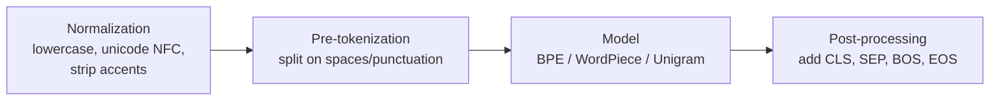

A transformer cannot read text. It reads a sequence of integers. **Tokenization** is the step that converts a string into those integers, using a fixed dictionary called the **vocabulary**. Every LLM interview touches this at least once.

## 1. Why not just words or characters?

- **Word-level**: vocabulary explodes (every typo, plural, and rare word is new), and anything unseen becomes `[UNK]` — the model literally cannot represent it.
- **Character-level**: tiny vocabulary and no unknowns, but sequences become very long, and attention cost grows as $O(n^2)$ in sequence length. The model also wastes capacity re-learning that `t-h-e` means "the".
- **Subword-level** (what everyone uses): common words stay whole (`the`), rare words split into meaningful pieces (`unbelievable` → `un + believ + able`). No unknowns, reasonable lengths.

![[tokenization-granularity.png]]

## 2. The tokenizer pipeline

Every modern tokenizer runs four stages (this framing is from the Hugging Face LLM course):



Example quirk worth knowing: GPT-2 marks a leading space with `Ġ` (`" how"` → `Ġhow`), SentencePiece marks it with `▁`. That is why `"hello"` and `" hello"` are **different tokens** with different ids.

## 3. The three algorithms that matter

### 3.1 Byte-Pair Encoding — BPE (GPT-2/3/4, LLaMA)

Train: start from single characters (or bytes), repeatedly **merge the most frequent adjacent pair** into a new token, until the vocabulary reaches the target size (Sennrich et al., 2015, arXiv:1508.07909).

Encode: split the word into characters, replay the learned merges in order.

```python
# Minimal BPE training loop — a classic interview exercise
from collections import Counter

def train_bpe(corpus_words, num_merges):
    # each word is a tuple of symbols, with its frequency
    vocab = Counter(tuple(w) for w in corpus_words)
    merges = []
    for _ in range(num_merges):
        pairs = Counter()
        for word, f in vocab.items():
            for a, b in zip(word, word[1:]):
                pairs[(a, b)] += f
        if not pairs:
            break
        best = max(pairs, key=pairs.get)          # most frequent adjacent pair
        merges.append(best)
        merged = {}
        for word, f in vocab.items():             # apply the merge everywhere
            w, i = [], 0
            while i < len(word):
                if i < len(word)-1 and (word[i], word[i+1]) == best:
                    w.append(word[i] + word[i+1]); i += 2
                else:
                    w.append(word[i]); i += 1
            merged[tuple(w)] = f
        vocab = merged
    return merges
```

**Byte-level BPE** (GPT-2 onward): start from the 256 raw bytes instead of unicode characters. Any string on earth is representable — zero `[UNK]`, at the cost of unreadable tokens for non-Latin scripts.

### 3.2 WordPiece (BERT)

Same merge idea, different selection rule. Instead of raw pair frequency, it picks the pair maximizing

$$
\text{score}(a,b) = \frac{\text{freq}(ab)}{\text{freq}(a)\cdot \text{freq}(b)}
$$

so it prefers pairs that are *informative together*, not just common. Continuation pieces carry a `##` prefix: `playing` → `play + ##ing`. Encoding is greedy longest-match from the start of the word.

### 3.3 Unigram (T5, many multilingual models; inside SentencePiece)

Works in the **opposite direction**: start from a huge candidate vocabulary, and repeatedly **remove** tokens whose removal least hurts the corpus likelihood. Each token gets a probability $p(t)$; a word's tokenization is the segmentation maximizing

$$
P(x_1,\dots,x_k) = \prod_{j=1}^{k} p(x_j)
$$

found with Viterbi. Probabilistic, so it can also *sample* alternative segmentations (used as regularization during training).

### 3.4 SentencePiece (the wrapper, not an algorithm)

Treats input as a raw unicode stream — no pre-splitting on spaces (spaces become `▁`). This makes it language-agnostic (works for Chinese/Japanese where spaces don't exist) and **losslessly reversible**: decode = concatenate and replace `▁` with space. It typically runs BPE or Unigram inside.

| | BPE | WordPiece | Unigram |
|---|---|---|---|
| Training direction | grow by merging | grow by merging | shrink by pruning |
| Merge/prune criterion | most frequent pair | highest pair score | least likelihood damage |
| Encoding | replay merges | greedy longest-match | Viterbi (most likely split) |
| Used by | GPT family, LLaMA | BERT family | T5, multilingual |

## 4. Special tokens

`[CLS]` (sentence representation, BERT), `[SEP]` / `</s>` (boundary), `[PAD]` (batch alignment, masked out of attention), `[UNK]` (unknown — should be near-impossible with byte-level BPE), `<BOS>`/`<EOS>` (generation start/stop). Chat models add role markers like `<|im_start|>`.

## 5. Practical facts interviewers like

```python
import tiktoken
enc = tiktoken.get_encoding("cl100k_base")     # GPT-4 tokenizer
enc.encode("unbelievable!")                     # -> [370, 31866, 12691, 0]
```

- Vocab sizes: GPT-2 **50,257**; GPT-4's `cl100k_base` ≈ **100k**; LLaMA-2 32k.
- Rule of thumb for English: **1 token ≈ 4 characters ≈ 3/4 of a word**.
- **Fertility** = average tokens per word; higher for languages underrepresented in training data → same sentence costs more context and more money in Hindi than English.
- Numbers tokenize inconsistently (`2024` may be one token, `20 24` two) — one reason LLMs are shaky at arithmetic.
- The famous "how many r's in strawberry" failure is a tokenization artifact: the model sees token ids, not letters.

## 6. Interview questions to be ready for
1. Why subword over word/char? (OOV vs sequence length trade-off)
2. Walk through one BPE merge step on a toy corpus. (Do it on paper: `low, lower, newest, widest`)
3. BPE vs WordPiece vs Unigram — training and encoding differences.
4. Why does GPT-2 use *byte-level* BPE? What problem disappears?
5. How does vocabulary size trade off against sequence length and embedding-matrix size ($V \times d$ parameters)?
6. Why is `" hello"` a different token from `"hello"`? Why does this matter for prompt engineering?

*Grounding: Hugging Face LLM course ch. 6 (pipeline, algorithm comparison table, Ġ/▁ behavior); Sennrich et al. 2015 (BPE, arXiv:1508.07909); SentencePiece: Kudo & Richardson 2018.*
